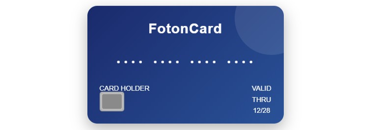
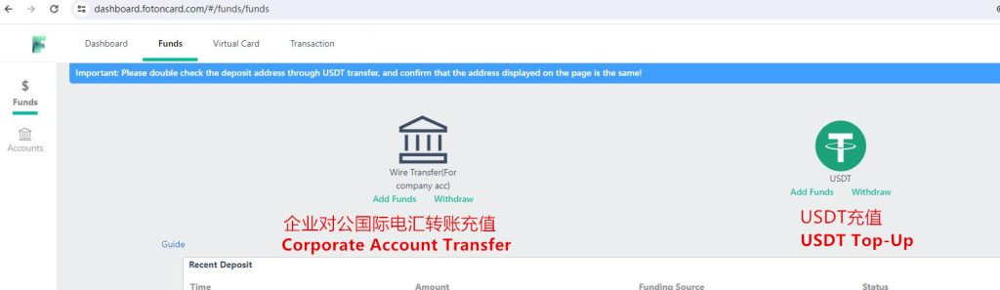
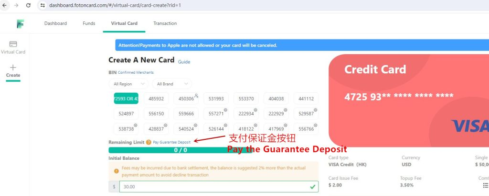
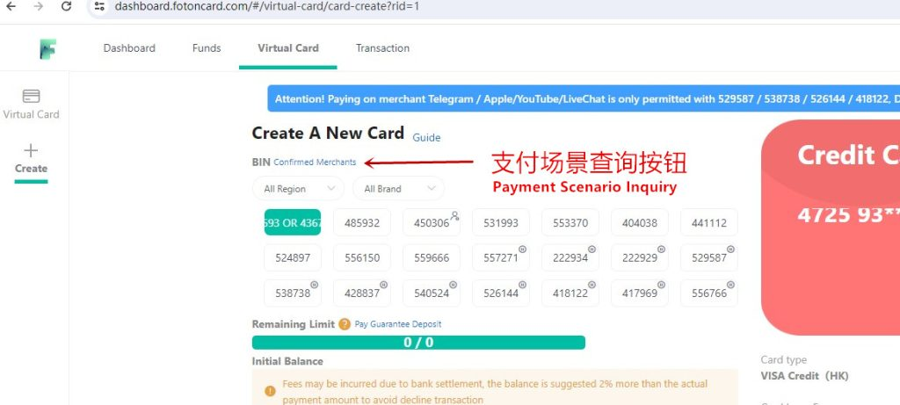
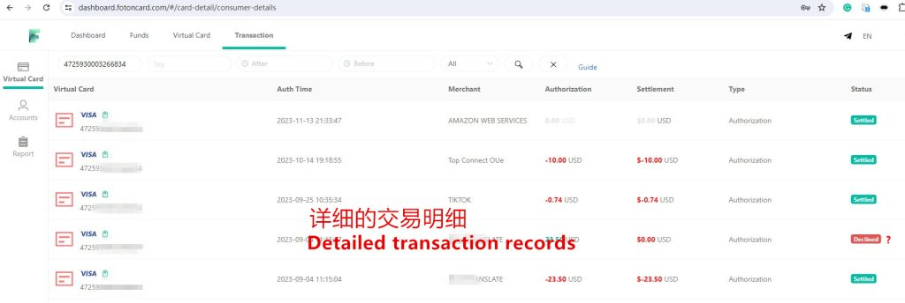

# Kartu Virtual Terbaik 2026 untuk Iklan Facebook & Media Buying

## Mengapa Memilih FotonCard? Untuk Iklan Facebook, Pemasaran Afiliasi, dan Periklanan

**FotonCard** adalah platform online profesional untuk menerbitkan kartu kredit virtual Mastercard dan Visa. Anda dapat membuat kartu virtual melalui FotonCard untuk kebutuhan bisnis maupun pribadi, termasuk e-commerce, iklan Facebook, dan berbagai langganan berbayar. Platform ini menekankan keamanan, anonimitas, dan kemudahan.

FotonCard bekerja sama dengan banyak mitra perbankan di berbagai wilayah seperti Amerika Serikat, Hong Kong, dan Singapura, serta menyediakan puluhan sumber BIN kartu, sehingga menjamin layanan kartu virtual (VCC) yang stabil dan jangka panjang.

Dengan biaya penerbitan kartu mulai dari **$3** dan **biaya transaksi mulai dari 1%**, FotonCard membantu mengurangi biaya penggunaan kartu secara massal bagi bisnis. Platform ini juga mendukung penerbitan kartu dalam jumlah besar untuk memenuhi kebutuhan pengeluaran korporat skala besar.

Kompatibel dengan berbagai platform internasional utama, pengguna hanya perlu alamat email untuk mendaftar dan mengaktifkan kartu dalam waktu 3 menit. FotonCard mendukung top-up menggunakan stablecoin USDT dan tidak memerlukan verifikasi KYC, sehingga privasi dan keamanan pengguna tetap terjaga.

**Merchant yang Didukung:** Iklan Facebook, Iklan TikTok, Iklan Google, Microsoft Azure, Shopify, ChatGPT, PayPal, App Store, dan 200+ merchant lainnya.

[**Daftar Sekarang**](https://dashboard.fotoncard.com/#/pages/register?agent=388832)

Setiap kartu dihasilkan secara independen dan diisolasi secara aman untuk melindungi privasi pembayaran online Anda.

## FotonCard Bermitra Erat dengan Berbagai Bank

FotonCard bermitra erat dengan berbagai bank untuk menyediakan puluhan sumber BIN kartu.

BIN kartu yang tersedia saat ini antara lain: 4367, 4725, 5572, 2229, 5295, 5387, 5261, 4181, 4719, 4859, 5319, 5533, 4040, 4411, 5248, 5561, 5596, 4288, 5405, 5567, 5563, 5592, 4503, dan lainnya.

Platform FotonCard secara berkala memperbarui BIN kartu baru atau menonaktifkan yang lama. Jika suatu BIN tidak dapat diaktifkan, silakan hubungi layanan pelanggan resmi untuk permintaan akses.

## Fitur Utama Kartu Virtual FotonCard

1. **Manajemen via HP/PC:** Kelola kartu virtual kapan saja, di mana saja melalui browser. Lihat riwayat transaksi dan sesuaikan pengaturan kartu secara real-time.
2. **Dashboard Mandiri:** Tidak perlu review manual—pilih jenis kartu bebas dan aktifkan instan. Antarmuka sederhana dan intuitif.
3. **Penyelesaian Instan:** Top-up via USDT atau transfer bank korporat, dana langsung tersedia dalam hitungan detik.
4. **Notifikasi Email:** Dapatkan pembaruan real-time tentang status pembayaran dan transaksi.
5. **Desain Ramah Pengguna:** UI/UX profesional dengan visualisasi data jelas—mudah digunakan bahkan oleh pemula.
6. **Pembayaran Aman:** Tidak perlu KYC atau cek kredit—privasi dan dana Anda terlindungi.

## Layanan Kartu Stabil Jangka Panjang untuk Pengguna

- 208 Merchant dengan pembayaran sukses  
- $2.567.899 Total volume transaksi sukses  
- 312.128 Pengguna terdaftar  
- 32.256 Kartu berhasil diterbitkan  

Platform FotonCard kini melayani lebih dari 310.000 pengguna dengan volume transaksi lebih dari $2,5 juta—solusi efisien untuk e-commerce lintas batas, kampanye iklan, dan pembayaran internasional.

## Aman dan Fleksibel

**Satu kartu, satu akun:** Setiap platform atau akun iklan menggunakan kartu virtual terpisah—mencegah risiko penipuan.  
**Batas pengeluaran bisa diatur:** Atur limit per transaksi atau bulanan untuk hindari pemborosan.

### Buka Peluang Baru

- **Iklan Digital:** Isi ulang iklan Facebook, Google, TikTok tanpa mengaitkan kartu utama Anda.
- **Langganan Platform:** Berlangganan Netflix, Spotify, atau AI Tools tanpa khawatir masa berlaku habis.
- **Pembelian Internasional:** Bayar layanan luar negeri tanpa memengaruhi limit kartu utama.

## Cara Mendaftar Akun FotonCard

Untuk pengguna PC, kunjungi situs resmi: [`https://fotoncard.com/`](https://fotoncard.com/). Anda wajib memasukkan **kode undangan 【388832】** saat pendaftaran agar proses berhasil.

[**Mulai Daftar FotonCard**](https://dashboard.fotoncard.com/#/pages/register?agent=388832)

## Panduan Aktivasi Kartu Virtual

Setelah mendaftar, Anda harus melakukan top-up saldo sebelum mengaktifkan kartu. Metode top-up yang tersedia:

- Transfer bank internasional dalam USD (proses manual, lebih lambat)
- Top-up via USDT (dana masuk dalam beberapa menit)

Kami sarankan deposit awal minimal $125.

Untuk menjaga stabilitas jangka panjang dan mencegah penyalahgunaan, platform menerapkan sistem deposit jaminan. Pengguna baru wajib membayar deposit **$100** untuk mengaktifkan kartu. Setelah 45 hari, jika kartu memiliki tingkat chargeback dan refund yang wajar, deposit tersebut akan **dikembalikan otomatis** ke saldo akun Anda. Kebijakan ini penting demi kelangsungan layanan kartu virtual FotonCard.

Setelah deposit dibayar, Anda bisa langsung membuat kartu virtual.

Pilih BIN kartu yang diinginkan, masukkan jumlah aktivasi, lalu buat kartu. Biaya aktivasi dan proses top-up bersifat tetap dan kompetitif.

## Gunakan Fitur Pencarian Merchant untuk Memilih BIN Kartu yang Tepat

Jika ragu BIN mana yang cocok, gunakan fitur **Merchant Terkonfirmasi** untuk mencocokkan kebutuhan bisnis Anda.

Contoh: Jika Anda menjalankan iklan TikTok, ketik **TikTok** untuk melihat BIN mana yang pernah sukses digunakan oleh pengguna lain di TikTok.

Data ini berdasarkan riwayat pembayaran pengguna sebelumnya. Hasil pencarian tidak menjamin keberhasilan 100%, namun sangat membantu dalam memilih BIN yang potensial.

Setelah kartu berhasil dibuat, Anda bisa melihat nomor kartu, tanggal kedaluwarsa, dan CVV untuk digunakan dalam pembayaran online.

Kartu berlaku hingga 2 tahun. Selama masa berlaku, Anda bisa mengisi ulang, menghapus kartu, melihat riwayat transaksi, atau mengakses kode verifikasi 3DS kapan saja.

## Pedoman Penggunaan Kartu

- Hanya untuk pembayaran online internasional yang sah (e-commerce, iklan, langganan layanan)
- Dilarang keras digunakan untuk aktivitas dengan tingkat chargeback/refund tinggi
- Layanan pelanggan 24/7 tersedia di pojok kanan atas dashboard
- Jika fokus pada Iklan Facebook, hubungi CS untuk negosiasi biaya top-up (minimal 1%)
- FotonCard belum memiliki aplikasi mobile, tetapi tetap nyaman digunakan via browser HP

## Pertanyaan Umum tentang Kartu Virtual FotonCard

### Untuk apa FotonCard digunakan?

Terutama untuk iklan Facebook, Google Ads, TikTok Ads, Shopify, dan kebutuhan media buying atau e-commerce lainnya.

### Apa syarat pendaftaran akun FotonCard?

Anda wajib memasukkan Kode Undangan: **388832**. Tanpa kode ini, pendaftaran tidak dapat diselesaikan.

### Berapa biayanya?

Biaya penerbitan kartu berkisar antara $2–$3 tergantung jenis kartu.

### Jenis kartu virtual apa yang ditawarkan?

FotonCard menyediakan kartu Visa dan Mastercard yang diterbitkan dari AS, Hong Kong, Singapura, dan Inggris.

### Bagaimana cara top-up?

Anda bisa top-up via transfer bank atau otomatis dengan USDT.

### Apakah bisa memilih BIN kartu?

Ya, Anda bisa memilih dari berbagai jenis kartu dengan BIN berbeda.

### Mengapa ada Deposit Jaminan?

Karena FotonCard bermitra langsung dengan bank besar, mereka harus menjaga tingkat penolakan kartu di bawah 20%. Sebelum 5 Juli 2023, kebijakan ini belum diterapkan, sehingga terjadi penyalahgunaan. Oleh karena itu, deposit $100 diberlakukan dan akan dikembalikan setelah 45 hari.

### Berapa banyak kartu yang bisa saya buat?

Dengan deposit $100 (dikembalikan setelah 45 hari), Anda bisa membuat 5–10 kartu. Jika performa kartu baik (reject rate <20%), Anda bisa membuat kartu tanpa batas.

### Apakah kartu bisa diisi ulang?

Ya, kartu bisa diisi ulang dan digunakan berulang kali selama masa berlaku.

### Apakah sisa saldo bisa dikembalikan?

Ya, sisa saldo akan dikembalikan ke akun Anda saat Anda menghapus kartu.

### Berapa batas pengeluaran kartu?

Batas transaksi tunggal bervariasi per BIN, mulai dari $2.000 hingga $10.000. Untuk batas bulanan, silakan hubungi layanan pelanggan.

---

Kartu virtual FotonCard mendukung sebagian besar merchant online global, memberikan pengalaman pembayaran yang aman dan nyaman untuk kebutuhan pribadi maupun bisnis. Platform ini terus memperbarui BIN kartu untuk memastikan tingkat keberhasilan pembayaran tetap tinggi.

© 2026 FotonCard. Hak Cipta Dilindungi.
